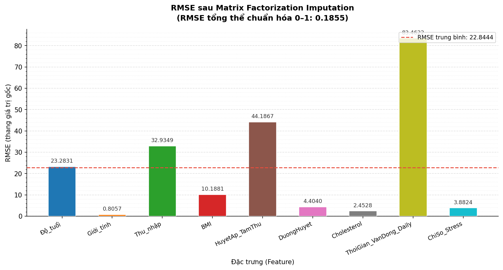
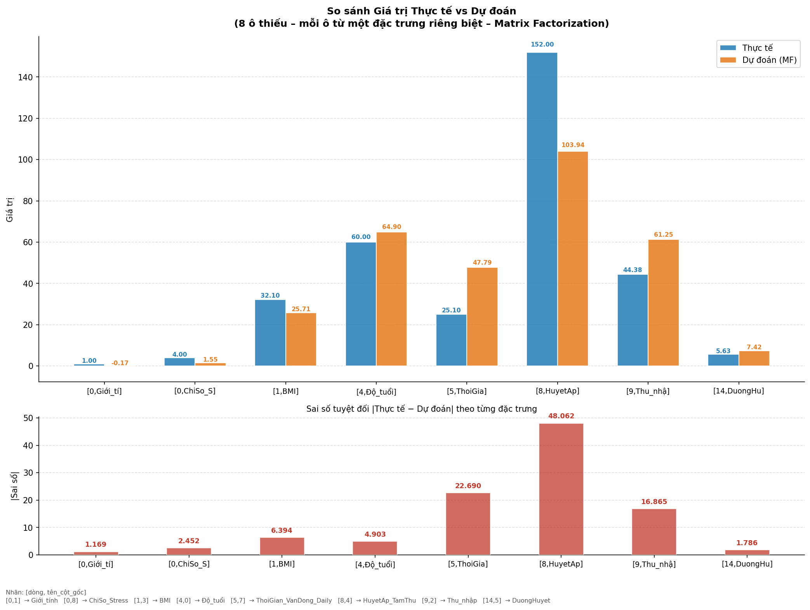

# Matrix Factorization – Missing Data Imputation
**Điền giá trị khuyết trên tập dữ liệu y tế công cộng bằng kỹ thuật Phân rã ma trận (SGD Matrix Factorization)**
## Mục lục

- [Tổng quan](#-tổng-quan)
- [Cấu trúc dự án](#-cấu-trúc-dự-án)
- [Mô tả bài toán & dữ liệu](#-mô-tả-bài-toán--dữ-liệu)
- [Kiến trúc thuật toán](#-kiến-trúc-thuật-toán)
- [Kết quả & Biểu đồ](#-kết-quả--biểu-đồ)
- [Cài đặt & Chạy](#-cài-đặt--chạy)
- [Tham số tinh chỉnh](#-tham-số-tinh-chỉnh)
- [Tác giả](#-tác-giả)

---

## Tổng quan

Dự án này giải quyết bài toán **điền giá trị khuyết (Missing Data Imputation)** trên tập dữ liệu y tế công cộng mô phỏng, sử dụng thuật toán **Phân rã ma trận theo Stochastic Gradient Descent (SGD-MF)**.

| Hạng mục | Chi tiết |
|---|---|
| Dữ liệu | 100 dòng × 9 cột, chủ đề y tế công cộng (mô phỏng) |
| Tỉ lệ thiếu | ~15% tổng số ô, sinh ngẫu nhiên |
| Phương pháp | SGD Matrix Factorization ( U × Vᵀ, k = 5 latent factors ) |
| Chuẩn hoá | Z-score trước khi phân rã  giải chuẩn hoá sau |
| Đánh giá | RMSE theo từng đặc trưng + RMSE tổng thể chuẩn hoá |

---

## Cấu trúc dự án

```
project/

  matrix_imputation.py     # Pipeline chính: sinh dữ liệu  tạo missing  MF  RMSE
  visualizer.py            # Biểu đồ cột RMSE theo từng đặc trưng
  comparison_plot.py       # Biểu đồ grouped bar: thực tế vs dự đoán (8 ô)

  rmse_chart.png           # Output: biểu đồ RMSE
  comparison_8cells.png    # Output: biểu đồ so sánh 8 ô thiếu

  README.md                # Tài liệu hướng dẫn (file này)
```

---

## Mô tả bài toán & dữ liệu

### Các đặc trưng (Features)

| # | Tên cột | Mô tả | Đơn vị | Khoảng giá trị |
|---|---|---|---|---|
| 1 | `Độ_tuổi` | Tuổi bệnh nhân | năm | 18  80 |
| 2 | `Giới_tính` | Giới tính | nhị phân | 0 = Nữ, 1 = Nam |
| 3 | `Thu_nhập` | Thu nhập hàng tháng | triệu VNĐ | 3  50 |
| 4 | `BMI` | Chỉ số khối cơ thể | kg/m² | 16  40 |
| 5 | `HuyetAp_TamThu` | Huyết áp tâm thu | mmHg | 90  180 |
| 6 | `DuongHuyet` | Đường huyết | mmol/L | 3.5  12.0 |
| 7 | `Cholesterol` | Cholesterol máu | mmol/L | 3.0  7.5 |
| 8 | `ThoiGian_VanDong_Daily` | Thời gian vận động mỗi ngày | phút | 0  120 |
| 9 | `ChiSo_Stress` | Chỉ số stress tự đánh giá | điểm | 1  10 |

---

## Kiến trúc thuật toán

```
Dữ liệu gốc (100×9)
        
        
 Tạo missing (~15%)
        
        
  Z-score chuẩn hoá
        
        

   SGD Matrix Factorization   
                              
   M  U (100×k) × Vᵀ (k×9) 
   k = 5 latent factors       
                              
   Cập nhật mỗi epoch:        
   U += lr × (E·V   reg·U)  
   V += lr × (Eᵀ·U  reg·V)  

        
        
  Giải chuẩn hoá (× std + mean)
        
        
   Tính RMSE (chỉ trên ô thiếu)
```

> **Lưu ý:** Gradient chỉ được tính trên **các ô quan sát được** (`observed_mask`), không cập nhật theo ô bị khuyết  đây là điểm mấu chốt của MF Imputation so với MF thông thường.

---

## Kết quả & Biểu đồ

### Biểu đồ RMSE theo đặc trưng (`rmse_chart.png`)



- Mỗi cột tương ứng một đặc trưng; **cột càng thấp**  mô hình dự đoán càng **chính xác**
- Đường đỏ đứt = RMSE trung bình toàn bộ đặc trưng
- `ThoiGian_VanDong_Daily` có RMSE cao nhất (83.46) do thang đo rộng (0120 phút)
- `Giới_tính`, `Cholesterol`, `ChiSo_Stress` có RMSE rất thấp  dự đoán tốt
- **RMSE tổng thể chuẩn hoá (01): 0.1855**  mô hình hoạt động ổn định

### Biểu đồ so sánh Thực tế vs Dự đoán (`comparison_8cells.png`)



- **Subplot trên:** Grouped bar  cột xanh (thực tế) và cột cam (dự đoán) đặt cạnh nhau cho 8 ô thiếu, mỗi ô từ một đặc trưng riêng
- **Subplot dưới:** Sai số tuyệt đối `|Thực tế  Dự đoán|` của từng ô

---

## Cài đặt & Chạy

### Bước 1  Clone dự án

```bash
git clone https://github.com/<your-username>/BDuyWeb.git
cd BDuyWeb
```

### Bước 2  Tạo môi trường ảo *(khuyến nghị)*

```bash
python -m venv venv

# Windows
venv\Scripts\activate

# macOS / Linux
source venv/bin/activate
```

### Bước 3  Cài đặt thư viện

```bash
pip install numpy pandas scikit-learn matplotlib
```

### Bước 4  Chạy pipeline chính

```bash
python matrix_imputation.py
```

**Terminal sẽ in ra theo thứ tự:**

```
1. Bảng dữ liệu gốc (5 dòng đầu)
2. Thống kê số ô bị khuyết theo cột
3. Tiến trình huấn luyện SGD (mỗi 100 epoch)
4. Bảng RMSE theo từng đặc trưng + RMSE tổng hợp
5. So sánh 10 ô thiếu đầu tiên: thực tế vs dự đoán
```

**File output được tạo tự động:**

| File | Mô tả |
|---|---|
| `rmse_chart.png` | Biểu đồ RMSE dọc theo đặc trưng |
| `comparison_8cells.png` | Biểu đồ grouped bar so sánh 8 ô thiếu |

---

## Tham số tinh chỉnh

Chỉnh trong hàm `matrix_factorization_sgd()` tại `matrix_imputation.py`:

| Tham số | Mặc định | Ảnh hưởng |
|---|---|---|
| `k` | `5` | Số latent factors  tăng  mô hình phức tạp hơn, dễ overfit |
| `lr` | `0.005` | Learning rate  tăng  hội tụ nhanh hơn nhưng dễ dao động |
| `reg` | `0.02` | Regularization  tăng  giảm overfit, nhưng có thể underfit |
| `n_epochs` | `500` | Số vòng lặp tối đa |
| `tol` | `1e-5` | Ngưỡng hội tụ sớm  giảm  train lâu hơn, kết quả chính xác hơn |

>  **Gợi ý:** Thử `k=10`, `lr=0.003`, `reg=0.01` nếu RMSE còn cao. Chạy nhiều lần với `random_seed` khác nhau để kiểm tra tính ổn định.

---

## Tác giả

**BDuyWeb**  Nhóm thực hành

Liên hệ: *(thêm email hoặc GitHub của nhóm tại đây)*

---

## Giấy phép

Dự án được sử dụng cho mục đích **học thuật** trong khuôn khổ đồ án môn học. Không sử dụng cho mục đích thương mại.
